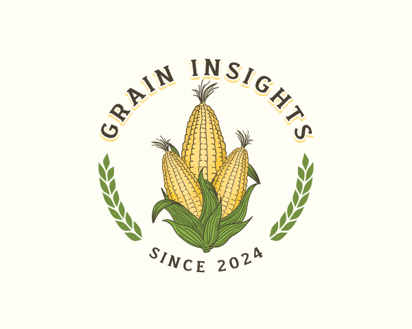

# Grain Insight



## Basmati Rice Grain Analyzer

### Motivation
India is the largest exporter of the rice in the world and second largest producer of rice in the world.
Grain Insights was started on the realisation that there is a lot of research available in the agricultural indistry to analyze the quality of the rice, but no freeware/open source solution is present for the same.
The project has started with Basmati Rice Grain Analysis, and would continue to add support for more grains.

### Goal
Grain Insights is born to create a open-source solution for the rice quality analysis.
Most agriculturists who ought to benefit from this kind of a solution are not tech savvy, hence Grain Insights will be available as a freemium service in the future.

This is a not for profit project. It's a medium of giving back.
Contributions are welcome!

### Project Structure
```
|  graininsight
|       - app
|       - frontend-landing-page
|       - dashboard
```
The project has three active deployments
1. app - Backend API hosted at api.grainscan.in
2. frontend-landing-page - Frontend Landing Page hosted at grainscan.in
3. dashboard - Grain Scan User Dashboard hosted at app.grainscan.in

Made with ❤️ in 🇮🇳 for the 🌎